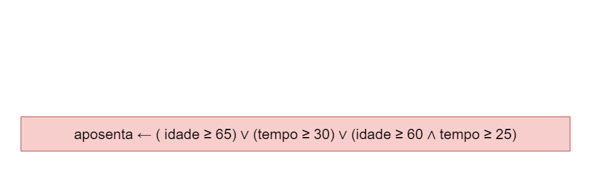

# Exercício 01 - Expressões Lógicas
  
## Introdução 

_"Suponha que, em determinado país, um cidadão pode se aposentar se satisfizer pelo menos uma das seguintes condições:_

_• Ter pelo menos 65 anos._  
_• Ter trabalhado pelo menos 30 anos._  
_• Ter pelo menos 60 anos e trabalhado pelo menos 25 anos._

_Escreva uma expressão lógica que, dadas as variáveis inteiras 𝑖𝑑𝑎𝑑𝑒 e 𝑡𝑒𝑚𝑝𝑜, representando a idade e o tempo de serviço, assume o valor T, se o cidadão pode seaposentar, ou F, caso contrário."_

## Resolução

