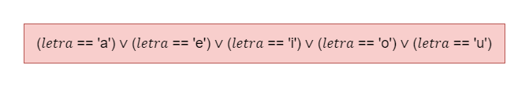

# Exercício 03 - Expressões Lógicas
  
## Introdução 

_"Escreva uma expressão lógica que, dado um caractere chamado 𝑙𝑒𝑡𝑟𝑎, representando uma letra do alfabeto latino, assume o valor T, se 𝑙𝑒𝑡𝑟𝑎 é uma vogal, ou F, se 𝑙𝑒𝑡𝑟𝑎 é uma consoante."_

## Resolução

