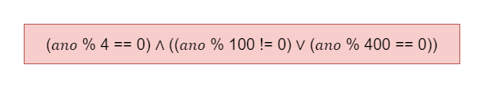

# Exercício 05 - Expressões Lógicas
  
## Introdução 

_"Um ano é bissexto se for divisível por 4. Mas essa regra tem uma exceção: os anos divisíveis por 100, apesar de serem divisíveis por 4, não são bissextos.     Porém, há uma exceção à exceção: os anos divisíveis por 400, apesar de serem divisíveis por 100, são sim bissextos.    Por exemplo:  
• 1983 não é bissexto, pois não é divisível por 4.  
• 1992 é bissexto, pois é divisível por 4 (e não se aplica a exceção).  
• 1900 não é bissexto, pois, apesar de ser divisível por 4, também é divisível por 100 (e se aplica a exceção).   • 2000 é bissexto, pois, apesar de ser divisível por 100, também é divisível por 400
(e se aplica a exceção à exceção).    
Escreva uma expressão lógica que, dada uma variável inteira 𝑎𝑛𝑜, assume o valor T,se o ano for bissexto, ou F, caso contrário.
"_

## Resolução

- Condição 1: Tem que ser divisível por 4.
- Condição 2: Não ser divisível por 100.
- Condição 3: Ano divisível por 400.

Condição 1 é "geral", tem que ter de qualquer maneira.   Porém, a condição 2 não pode ocorrer em conjunto com a condição 3 (não podem acontecer ao mesmo tempo)

