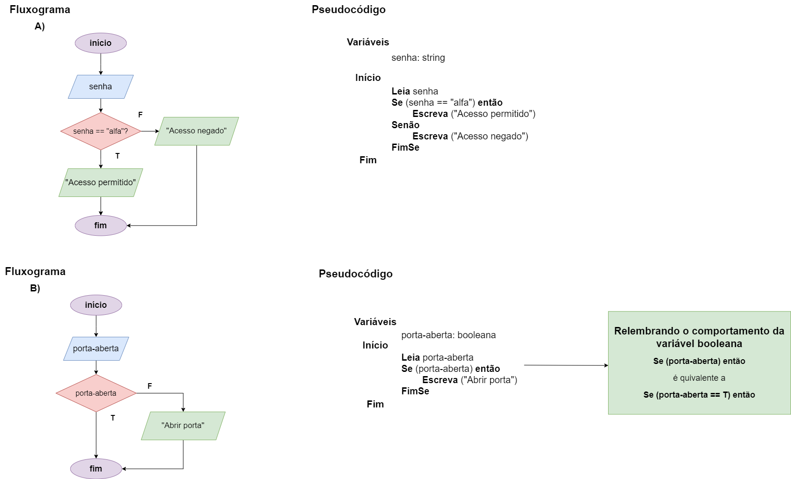

# Exercício 01 - Fluxo Condicional
  
## Introdução 

_"Imagine que você está projetando um sistema de segurança para controle de acesso a uma sala. Para entrar na sala, o usuário deve digitar a senha correta, que é "alfa"._

**(a)** _Escreva um fluxograma e um pseudocódigo para um algoritmo que lê uma string representando uma senha e escreve a mensagem Acesso permitido, se o usuário entrar com a senha correta, ou Acesso negado, caso contrário._

**(b)** _Suponha agora que exista um sensor de porta aberta. Este sensor é representado por uma variável booleana chamada 𝑝𝑜𝑟𝑡𝑎-𝑎𝑏𝑒𝑟𝑡𝑎 que é automaticamente definida para T, se a porta estiver aberta, ou F, caso contrário. O sistema deverá abrir a porta apenas se ela estiver fechada._
"_

## Resolução

