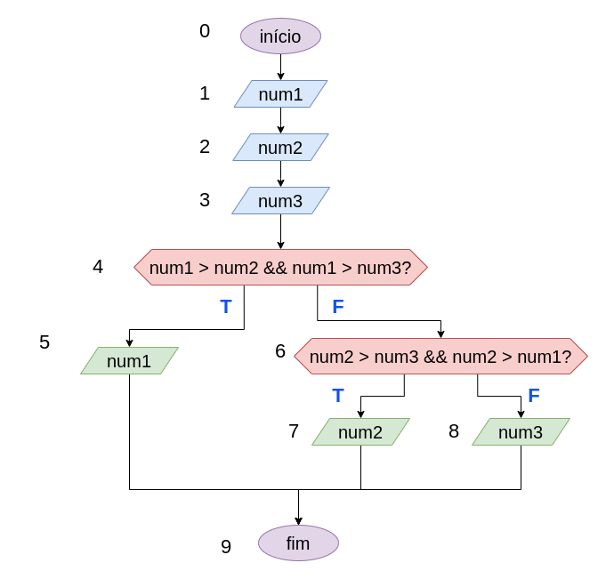

# Exercício 02 - Fluxo Condicional
  
## Introdução 

_"Escreva um fluxograma para um algoritmo que lê três números reais e escreve o maior deles.     Em seguida, efetue testes de mesa com as seguintes entradas:    
(a) 1.0, 2.5, 4.0.  
(b) 5.0, 2.5, 4.0.  
(c) 1.0, 6.3, 0.5.  
(d) 1.0, 2.6, 2.6."_

## Resolução

### Teste de mesa (a)

1.0, 2.5, 4.0

|Inst|num1|num2|num3|
----|----|----|----
|0|?|?|?|
|1|1.0|?|?|
|2|1.0|2.5|?|
|3|1.0|2.5|4.0|
|4|1.0|2.5|4.0|
|6|1.0|2.5|4.0|
|8|1.0|2.5|4.0|
|9|1.0|2.5|4.0|

### Teste de mesa (b)

5.0, 2.5, 4.0

|Inst|num1|num2|num3|
----|----|----|----
|0|?|?|?|
|1|5.0|?|?|
|2|5.0|2.5|?|
|3|5.0|2.5|4.0|
|4|5.0|2.5|4.0|
|5|5.0|2.5|4.0|
|9|5.0|2.5|4.0|

### Teste de mesa (c)

1.0, 6.3, 0.5

|Inst|num1|num2|num3|
----|----|----|----
|0|?|?|?|
|1|1.0|?|?|
|2|1.0|6.3|?|
|3|1.0|6.3|0.5|
|4|1.0|6.3|0.5|
|6|1.0|6.3|0.5|
|7|1.0|6.3|0.5|
|9|1.0|6.3|0.5|

### Teste de mesa (d)

1.0, 2.6, 2.6

|Inst|num1|num2|num3|
----|----|----|----
|0|?|?|?|
|1|1.0|?|?|
|2|1.0|2.6|?|
|3|1.0|2.6|2.6|
|4|1.0|2.6|2.6|
|6|1.0|2.6|2.6|
|8|1.0|2.6|2.6|
|9|1.0|2.6|2.6|

#### Atenção letra (d)

Foram dados dois números iguais, num2 e num3.    
Isso pode nos levar a pensar que é preciso colocar uma outra estrutura de decisão no fluxograma, para o caso em que os dois são iguais. 

Porém... O exercício pede o maior valor entre os 3 números. Assim, como num2 e num3 tem o mesmo valor, tanto faz qual das variáveis apresentar na saída. No final, é apresentado o maior número (2.6)
