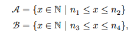
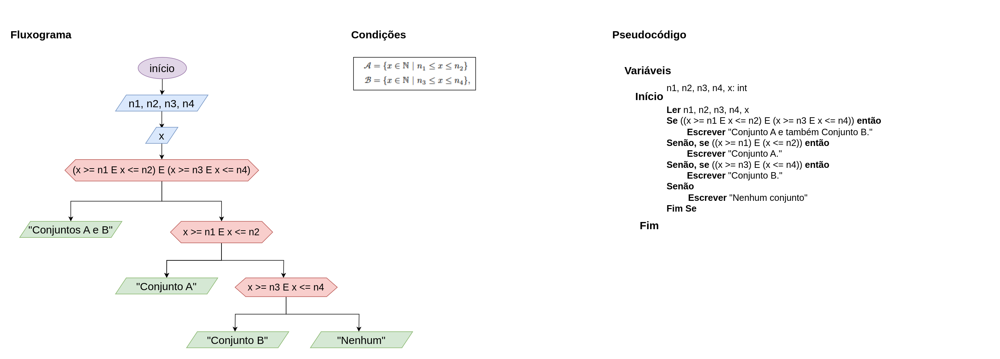

# Exercício 03 - Fluxo Condicional
  
## Introdução 

_"Considere os dois conjuntos:_

em que 𝑛1
, 𝑛2
, 𝑛3
, 𝑛4
 são inteiros. Implemente um algoritmo na forma de fluxograma
e pseudocódigo que, dados os valores de 𝑛1
, 𝑛2
, 𝑛3
, 𝑛4
, bem como de um inteiro 𝑥,
e informa se 𝑥 pertence somente ao conjunto 𝒜, somente ao conjunto ℬ, a ambos
os conjuntos, ou a nenhum deles. Identifique os dados de entrada e os de saída."_

## Resolução

- **Entrada:** n1, n2, n3 e n4
- **Saída:** As mensagens em verde a depender do caso.

