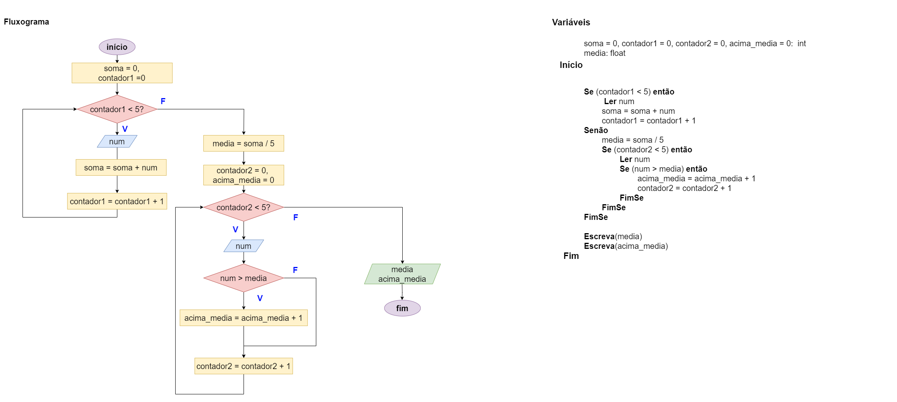

# Exercício 04 - Fluxo Condicional
  
## Introdução 

_"Escreva um fluxograma para um algoritmo que lê cinco números reais e escreve a
média e a quantidade de números (dentre estes cinco números) que estão acima da
média. Efetue um teste de mesa com a entrada 3.4, 2.0, 1.5, 4.0, 2.1; a saída deverá
ser 2.6, 2, pois a média é 2.6 e há dois números acima da média."_

## Resolução

falta realizar o teste de mesa! 😛

