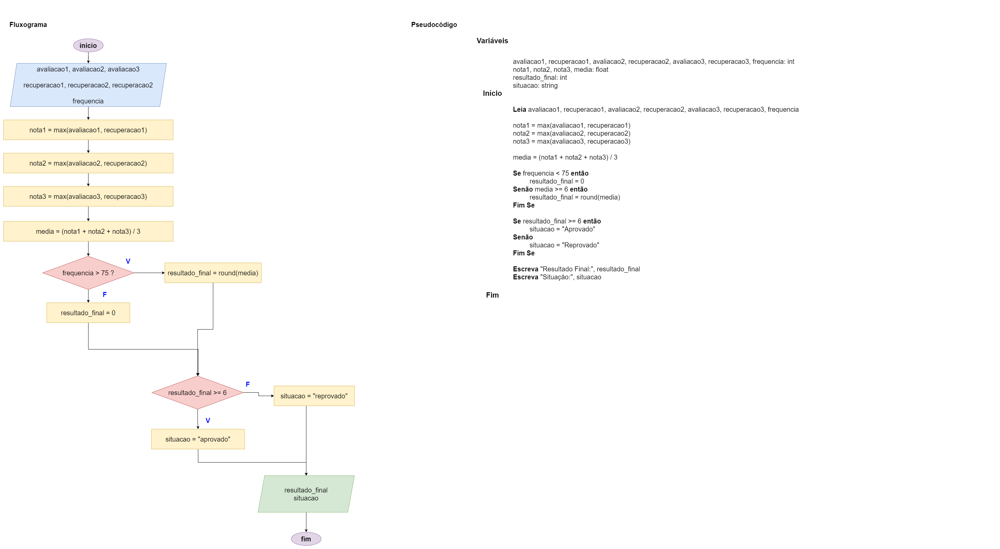

# Exercício 05 - Fluxo Condicional
  
## Introdução 

_". Em uma certa disciplina de um determinado curso de graduação, os alunos são
avaliados por meio de três avaliações individuais e sem consulta, com pontuações
inteiras de até 10 pontos. Cada avaliação possui uma recuperação, onde o maior
valor obtido entre a avaliação original e a recuperação é considerado. O resultado
final da disciplina é calculado pela média aritmética simples das três avaliações,
arredondada para o inteiro mais próximo. O resultado mínimo para aprovação na
disciplina é 6. Alunos com frequência inferior a 75% receberão o resultado 0.
Escreva um fluxograma e um pseudocódigo para um algoritmo que lê os valores das
três avaliações, das três recuperações e da frequência do aluno, e escreve o resultado
final da disciplina e a situação do aluno (aprovado ou reprovado). Assuma que, caso
o aluno não tenha realizado a recuperação de uma das avaliações, a nota será entrada como zero.
Assuma que existam as funções max (que retorna o maior valor entre dois números)
e round (que arredonda um número real para o inteiro mais próximo).
"_

## Resolução

falta realizar o teste de mesa! 😛

