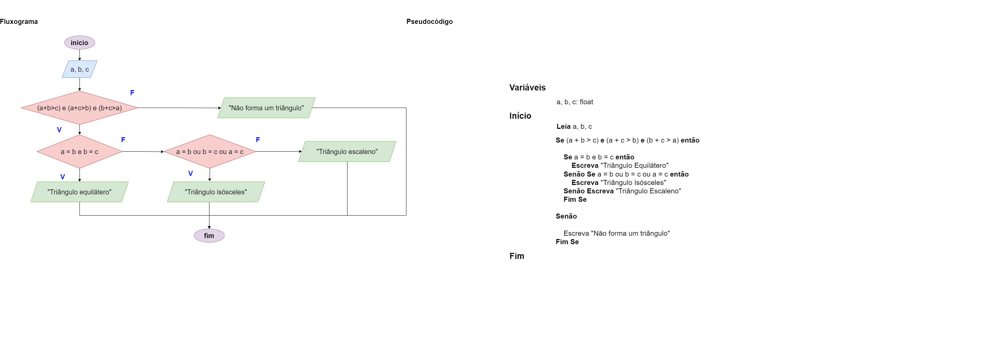

# Exercício 06 - Fluxo Condicional
  
## Introdução 

_"Dados três segmentos de reta 𝑎, 𝑏 e 𝑐, sabemos que eles podem formar um triângulo se e somente se a soma de quaisquer dois lados é sempre maior que o terceiro
lado. Por exemplo:
• Os números (3, 4, 5) formam um triângulo, pois:
3 + 4 > 5, 3 + 5 > 4, 4 + 5 > 3.
• Os números (2, 3, 6) não formam um triângulo, pois:
2 + 3 > 6, ainda que 3 + 6 > 2 e 2 + 6 > 3.
Além disso, se os três lados de um triângulo são iguais, então ele é chamado de
triângulo equilátero. Se dois lados são iguais e o terceiro é diferente, então ele é
chamado de triângulo isósceles. Se todos os lados são diferentes, então ele é chamado de triângulo escaleno."_

## Resolução

