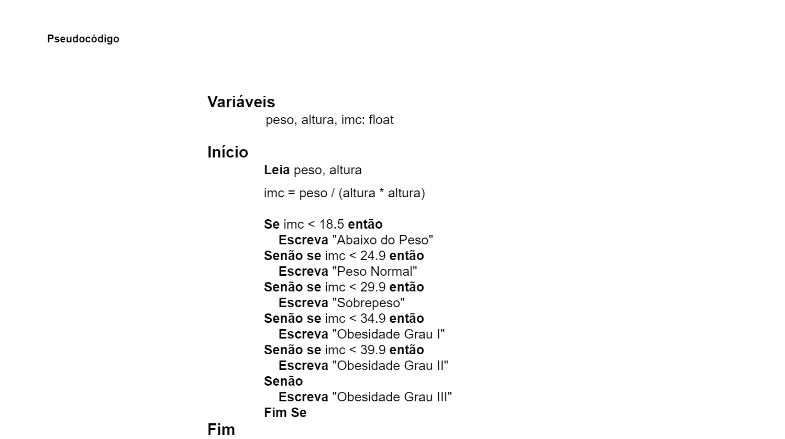

# Exercício 07 - Fluxo Condicional
  
## Introdução 

_"Escreva um pseudocódigo para um algoritmo que lê dois números reais representando o peso e a altura de uma pessoa e escreve o índice de massa corpórea
(IMC) desta pessoa, bem com a classificação do seu estado nutricional. Utilize o
comando SenãoSe. Veja a página do Ministério da Saúde para mais informações
sobre o IMC e a classificação do estado nutricional."_

## Resolução

