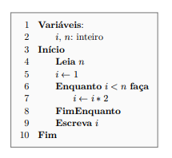
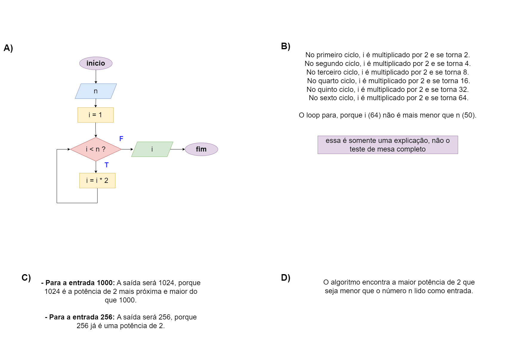

# Exercício 01 - Fluxo Iterativo
  
## Introdução 

_"Considere o pseudocódigo ao lado.    
(a) Converta o pseudocódigo para fluxograma.  
(b) Efetue um teste de mesa com a entrada 50.  
(c) Sem efetuar teste de mesa, determine a saída
para a entrada 1000. Repita para 256.  
(d) Descreva, em palavras, o problema resolvido
pelo algoritmo (não descreva o algoritmo
em si)"_

## Resolução

