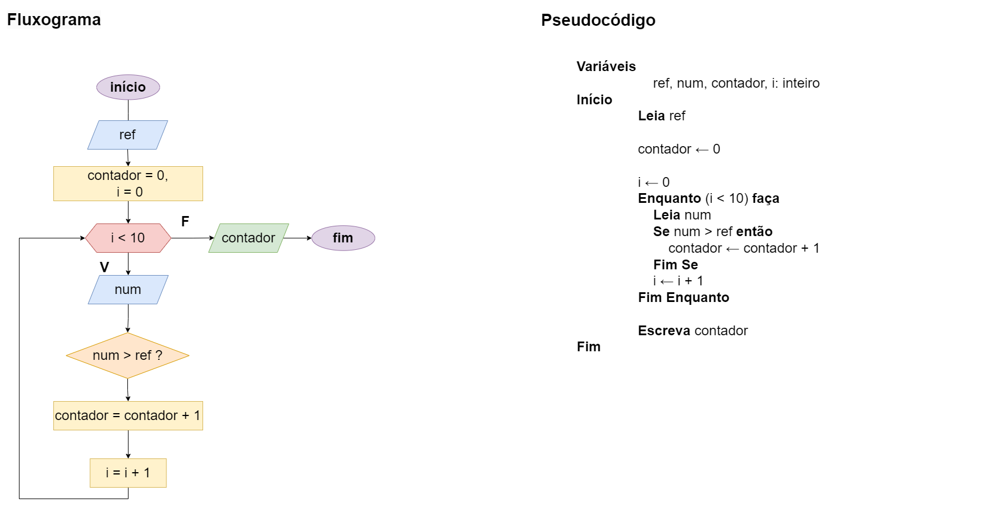

# Exercício 02 - Fluxo Iterativo
  
## Introdução 

_"Escreva um fluxograma e um pseudocódigo para um algoritmo que lê um número inteiro de referência, seguido de mais dez números inteiros. O algoritmo deve escrever
a quantidade de números maiores que o número de referência. Utilize Enquanto."_

## Resolução

