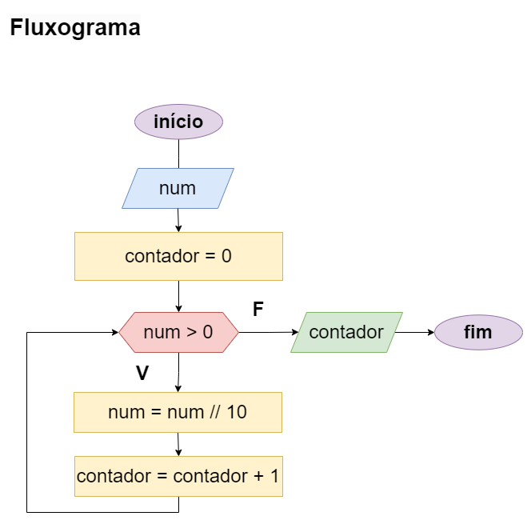

# Exercício 03 - Fluxo Iterativo
  
## Introdução 

_"Escreva um fluxograma para um algoritmo que lê um inteiro positivo e escreve a
quantidade de dígitos do número lido. Dica: Utilize o operador de divisão inteira."_

## Resolução

#### Conceito de divisão inteira (//)
É uma operação que retorna somente a parte inteira do resultado da divisão entre dois números.

Ideia inicial para o problema...

...Supondo o caso do número 1234.   1234//10, será 123.  
Pois a parte inteira da divisão é 123, descartando o que vem depois da vírgula   (123,4 onde 4 é descartado)

#### Aplicando na resolução

Pensar que a cada iteração, vai realizar uma divisão inteira e contar + 1 até que o número que está sendo dividido chegue em zero. 😊

