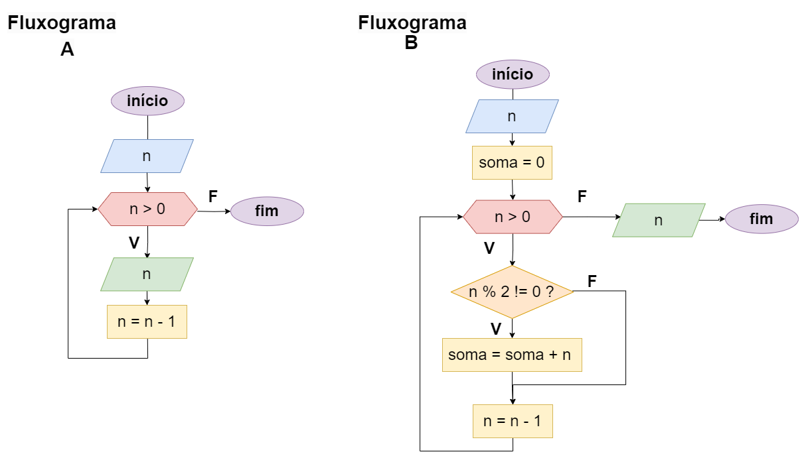

# Exercício 04 - Fluxo Iterativo
  
## Introdução 

_"**(a)** Escreva um fluxograma e um pseudocódigo para um algoritmo que lê um inteiro
positivo 𝑛 e escreve todos os números pares menores ou iguais a 𝑛, em ordem
decrescente, até 0.    
**(b)** Modifique sua resposta para que, adicionalmente, seja impressa a soma de todos
os números ímpares menores ou iguais a 𝑛."_

## Resolução

