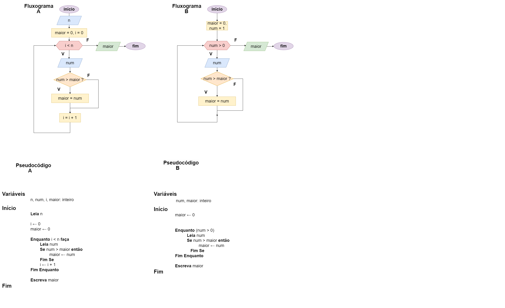

# Exercício 05 - Fluxo Iterativo
  
## Introdução 

_"**(a)** Escreva um fluxograma e um pseudocódigo para um algoritmo que lê um inteiro
positivo 𝑛, seguido de 𝑛 números inteiros (assuma todos positivos), e escreve o
maior número lido. Utilize Enquanto. Efetue um teste de mesa com a entrada
5 7 2 15 21 15; a saída deve ser 21.
5/6    
**(b)** Suponha agora não será informado o número de valores a serem lidos. No lugar,
a leitura dos números deve ser encerrada quando o usuário entrar com 0 (zero).
Utilize Faça / Enquanto. Efetue um teste de mesa com a entrada 7 2 15 21
15 0; a saída deve ser 21.
"_

## Resolução

