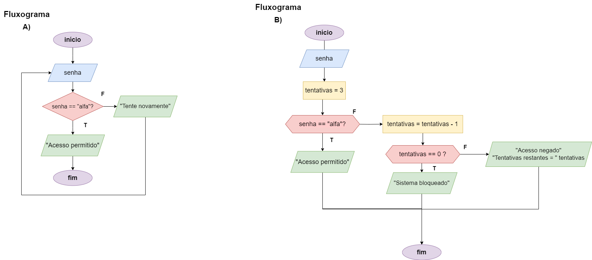

# Exercício 06 - Fluxo Iterativo
  
## Introdução 

_"Este exercício é uma continuação direta do exercício sistema de segurança para
controle de acesso, da Parte 3.    
(a) Modifique seu fluxograma de modo que o sistema opere em um loop infinito,
até que o usuário digite a senha correta.    
(b) Modifique novamente, agora supondo que o usuário tem 3 tentativas para digitar a senha correta. Caso o usuário erre a senha, o sistema deve informar
quantas tentativas restam. Quando o usuário errar a senha pela terceira vez, o
sistema deve escrever a mensagem Sistema bloqueado e encerrar"_

## Resolução

