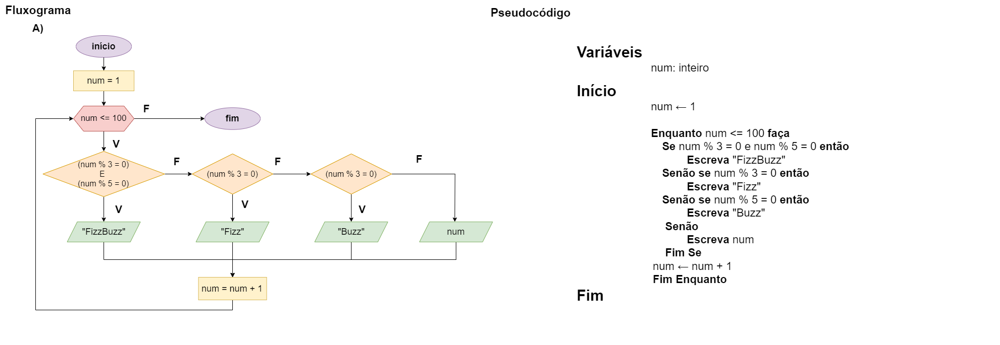

# Exercício 07 - Fluxo Iterativo
  
## Introdução 

_"Escreva um fluxograma e um pseudocódigo para um algoritmo que escreve na tela
os números de 1 a 100, um em cada linha, levando em conta o seguinte:    
• Quando o número for múltiplo de 3, escreva Fizz ao invés do número.  
• Quando o número for múltiplo de 5, escreva Buzz ao invés do número.  
• Quando o número for simultaneamente múltiplo de 3 e de 5, escreva FizzBuzz ao
invés do número."_

## Resolução

