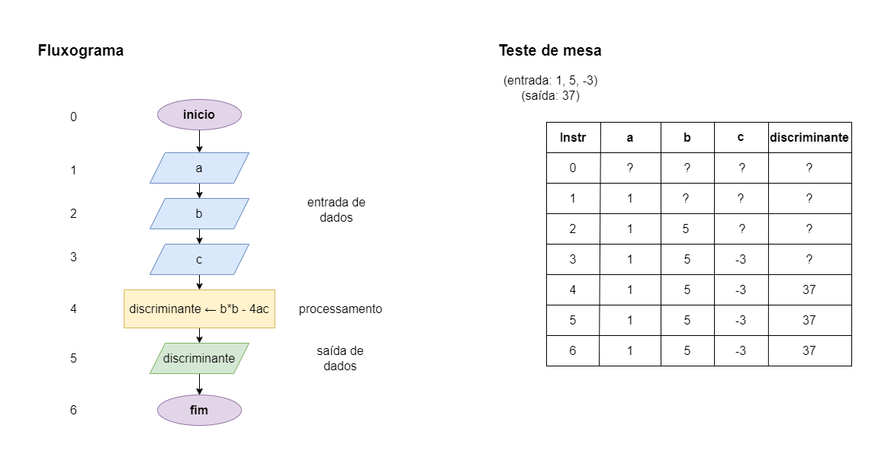

# Exercício 03 - Introdução
  
## Introdução  

_"Escreva um fluxograma para um algoritmo que lê três números reais 𝑎, 𝑏 e 𝑐, representando os coeficientes de uma equação de segundo grau, e escreve o valor do discriminante **Δ = 𝑏^2 − 4𝑎𝑐** da equação.   Assuma que não há operador de exponenciação disponível.   Em seguida, execute um teste de mesa com a entrada 1, 5, -3; asaída deve ser 37."_

## Resolução

### Extra

Em C, existe uma biblioteca chamada **<math.h>** que tem uma funcionalidade que permite elevar um número a um expoente. 

Então, quando é necessário elevar o expoente a um número muito alto, a biblioteca pode ser útil! 🥰
