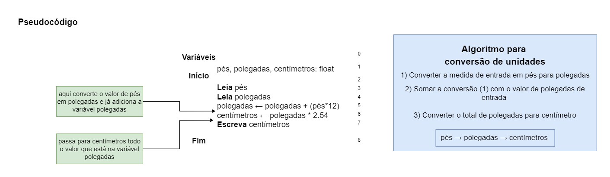
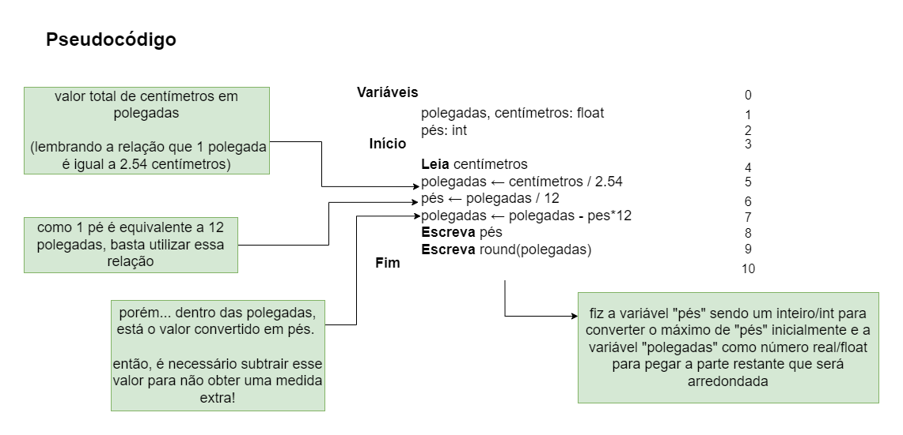

# Exercício 04 - Introdução
  
## Introdução  
<div align="center">

_"Nos Estados Unidos da América, a altura de uma pessoa é medida em pés + polegadas. Por exemplo, considere uma pessoa com 5 pés + 11 polegadas de altura (escrito simplesmente como 5'11"); sabendo que 1 pé equivale a 12 polegadas, e 1 polegada equivale a 2.54 centímetros, conclui-se que tal pessoa tem por volta de 180.34 centímetros de altura"_

**A)** _"Escreva um pseudocódigo para um algoritmo que lê dois números inteiros representando os valores da altura de uma pessoa em pés + polegadas, e escreve o valor da altura em centímetros. Em seguida, execute um teste de mesa com a entrada 5, 11; a saída deve ser 180.34"_

**B)** _"Repita o item anterior, mas agora supondo que é lido um único valor em centímetros e são escritos os valores em pés e polegadas correspondentes. Assuma que exista uma função chamada round que arredonda um número real para 1/6 o inteiro mais próximo; por exemplo, round(3.14) = 3 e round(3.86) = 4. Em seguida, execute um teste de mesa com a entrada 180; a saída deve ser 5, 11"_

</div>

## Resolução

### A)

<div align="center">

#### Pseudocódigo



#### Teste de mesa

|Inst|pés|polegadas|centímetros|
----|----|----|----
|0|?|?|?|
|1|?|?|?|
|2|?|?|?|
|3|5|?|?|
|4|5|11|?|
|5|5|71|?|
|6|5|71|180.34|
|7|5|71|180.34|
|8|5|71|180.34|

</div>

### B)

<div align="center">

#### Pseudocódigo




#### Teste de mesa

|Inst|pés|polegadas|centímetros|
----|----|----|----
|0|?|?|?|
|1|?|?|?|
|2|?|?|?|
|3|?|?|?|
|4|?|?|180|
|5|?|70.866|180|
|6|5|70.866|180|
|7|5|10.866|180|
|8|5|10.866|180| 
|9|5|11|180|
|10|5|11|180|

</div>


### Extra para letra B

Um código em C para auxiliar no teste de mesa 🤗

```c
#include <stdio.h>
#include <math.h>

int main() {
    float centimetros;
    printf("Digite a altura em centímetros: ");
    scanf("%f", &centimetros);

    float polegadas = centimetros / 2.54;
    int pes = polegadas / 12;
    polegadas = polegadas - pes*12;

    printf("Altura: %d' %.f''\n", pes, round(polegadas));

    return 0;
```

Mas... Por que foi utilizado int para "pes" e float para "polegadas"? <br> <br>
Em resumo, é por conta do arredondamento que é feito com a função "round" dada a lógica que foi implementada no código. Ao usar int para polegadas também, perdemos a parte fracionária e o arredondamento não funciona corretamente como foi instruído no exercício.

