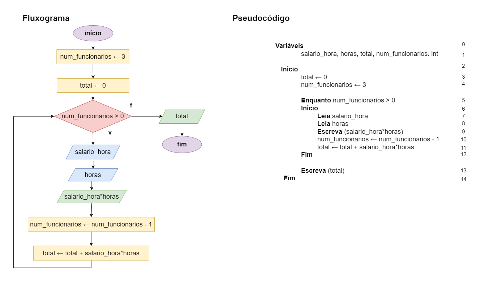

# Exercício 05 - Introdução
  
## Introdução  

_"Escreva um fluxograma e um pseudocódigo para um algoritmo que lê os salários por
hora (em R$ por hora) e as horas trabalhadas de três colaboradores de uma empresa
e escreve o pagamento de cada um deles, bem como o total pago pela empresa._

_Não utilize mais que quatro variáveis. A ordem de leitura dos dados de entrada deve ser:
Salário do colaborador 1, horas trabalhadas do colaborador 1, salário do
colaborador 2, horas trabalhadas do colaborador 2, salário do colaborador 3,
horas trabalhadas do colaborador 3._

_A ordem de escrita dos dados de saída deve ser:
Pagamento do colaborador 1, pagamento do colaborador 2, pagamento do colaborador 3, total pago pela empresa._

_Em seguida, execute um teste de mesa com a entrada 50, 8, 60, 7, 50, 7.5; a saída
deve ser 400, 420, 375, 1195."_

## Resolução

### Teste de mesa

Primeira iteração (funcionário 1)

|Inst|salario_hora|hora|total|num_funcionarios|
----|----|----|----|----|
|0|?|?|?|?|
|1|?|?|?|?|
|2|?|?|?|?|
|3|?|?|0|?|
|4|?|?|0|3| funcionario num
|5|?|?|0|3| enquanto
|6|?|?|0|3| inicio
|7|50|?|0|3| ler salario_hora
|8|50|8|0|3| ler hora
|9|50|8|0|3| escreve
|10|50|8|0|2| diminui func
|11|50|8|400|2| total
|12|50|8|400|2| fim

Segunda iteração (funcionário 2)

|Inst|salario_hora|hora|total|num_funcionarios|
----|----|----|----|----|
|5|50|8|400|2| enquanto 
|6|50|8|400|2| inicio
|7|60|8|400|2| ler salario_hora
|8|60|7|400|2| ler hora
|9|60|7|400|2| escreve
|10|60|7|400|1| diminui func
|11|60|7|820|1| total
|12|60|7|820|1| fim

Terceira iteração (funcionário 3)

|Inst|salario_hora|hora|total|num_funcionarios|
----|----|----|----|----|
|5|60|7|820|1| enquanto
|6|60|7|820|1| inicio
|7|50|7|820|1| ler salario_hora
|8|50|7.5|820|1| ler hora
|9|50|7.5|820|1| escreve
|10|50|7.5|820|0| diminui func
|11|50|7.5|1195|0| total
|12|50|7.5|1195|0| fim

Leu todos os funcionários, sai do laço

|Inst|salario_hora|hora|total|num_funcionarios|
----|----|----|----|----|
|5|60|7|820|0| enquanto (Falso)
|13|50|7.5|1195|0| escreve total
|14|50|7.5|1195|0| fim

  

**Obs: Iteração significa uma repetição do laço.**

