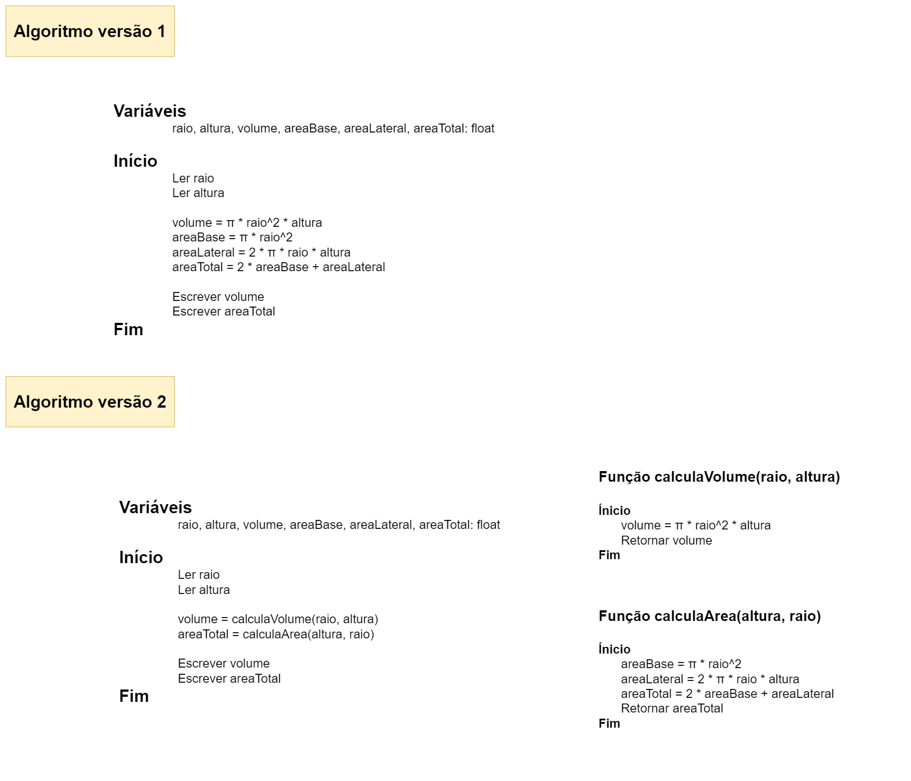

# Exercício 01 - fixação
  
## Introdução 

_"Implementar um algoritmo para determinar o volume e a área total da superfície de um cilindro, dados o raio da base e a altura. Responda:    
• Quais são os dados de entrada? As variáveis que receberão estes dados
devem ser de que tipo?    
• Quais são os dados de saída? Estes dados serão armazenados em variáveis
de que tipo?    
• Quais constantes estão sendo usadas nas expressões para calcular o volume e a área?"_

## Resolução

- **Entrada:** Raio da base e altura do cilíndro. As variáveis são do tipo float

- **Saída:** Volume e área total do cilíndro. Armazenados em variáveis do tipo float.

- **Constantes:** Pi.

