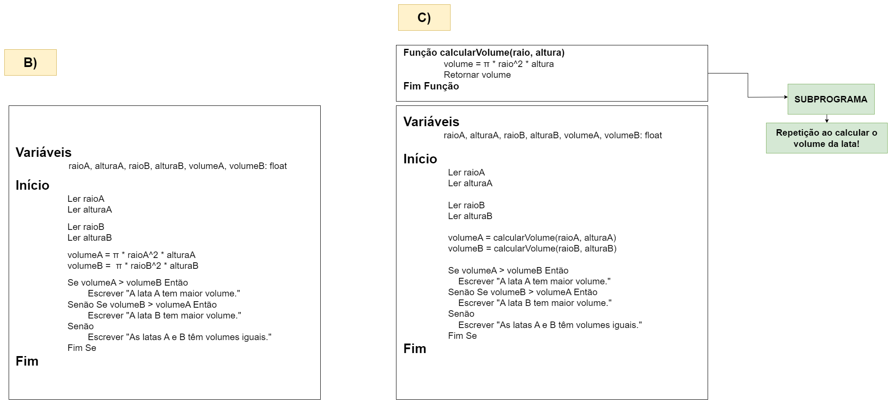

# Exercício 02 - fixação
  
## Introdução 

_"Considere um algoritmo que permite comparar os volumes de duas latas (A
e B) de refrigerante que podem ser aproximadas por cilindros. O algoritmo
deve receber as dimensões das latas e deve informar qual lata possui maior
volume ou se elas possuem volumes iguais.    
**(a)** Quais são os dados de entrada e saída deste algoritmo?    
**(b)** Escreva um pseudocódigo para resolver o problema, sem usar subprogramas.    
**(c)** Refaça, agora aplicando o conceito de subprogramas. Identifique qual
“pedaço” de código se repete."_

## Resolução

- **Entrada:** Dimensões das latas.

- **Saída:** Resultado da comparação do volume das latas.

