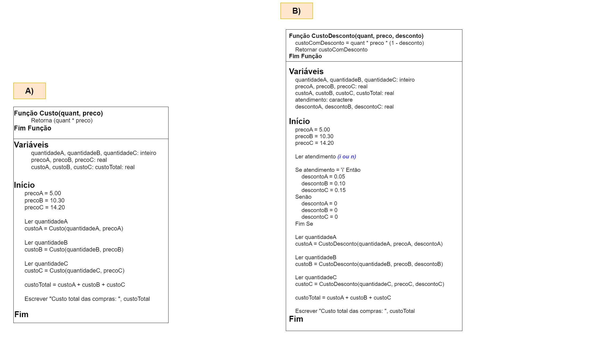

# Exercício 03 - fixação
  
## Introdução 

_"Uma loja vende apenas três produtos: A, B e C. Estes produtos são sempre
vendidos em unidades. O preço de cada produto é R$ 5.00, R$ 10.30 e R$
14.20, respectivamente. O atendente informa a um algoritmo que se executa
no seu caixa a quantidade de produtos A, B e C que o cliente vai levar, nesta
ordem. Se for informada quantidade 0 ou negativa, o algoritmo assume que
não está sendo levado o item e passa a ler o próximo. Ao final mostra o custo
total das compras.    
**(a)** Como seria um pseudocódigo deste algoritmo?    
**(b)** Suponha que a loja proporciona benefícios para a terceira idade. No início do atendimento o algoritmo recebe o caractere 'i' de idoso ou 'n'
de atendimento normal (qualquer outra letra deve ser interpretada como
atendimento normal). Caso seja idoso, a loja proporciona desconto de
5% no produto A, 10% no produto B e 15% no produto C. Modifique o
pseudocódigo para contemplar esta situação.
"_

## Resolução

