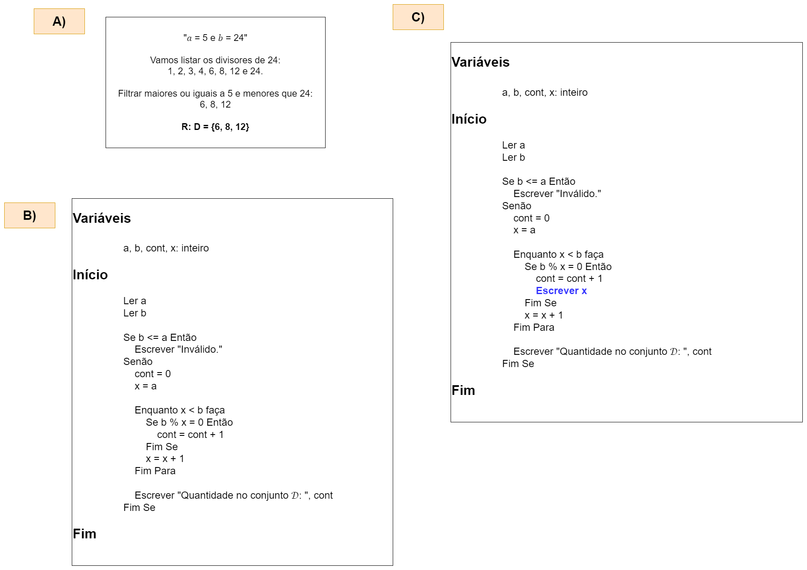

# Exercício 04 - fixação
  
## Introdução 
<div align="center">

_" Considere o conjunto 𝒟 definido da seguinte forma:_
```
𝒟 = {𝑥 ∈ ℕ | 𝑎 ≤ 𝑥 < 𝑏 e 𝑥 é divisor de 𝑏}
```
_onde 𝑎 e 𝑏 são números inteiros._ <br> <br>
_**(a)** Determine (na mão) o conjunto 𝒟 para 𝑎 = 5 e 𝑏 = 24. <br> <br>
**(b)** Implemente um algoritmo para ler 𝑎 e 𝑏. O algoritmo deve então informar quantos números existem no conjunto 𝒟. Caso 𝑏 seja menor ou igual
a 𝑎, o algoritmo deve informar esta situação e se encerrar. <br> <br>
**(c)** Modifique o algoritmo para que, além de informar quantos números existem em 𝒟, informar também em ordem decrescente quais são os números
pertencentes a 𝒟."_

</div>

## Resolução

<div align="center">



</div>
