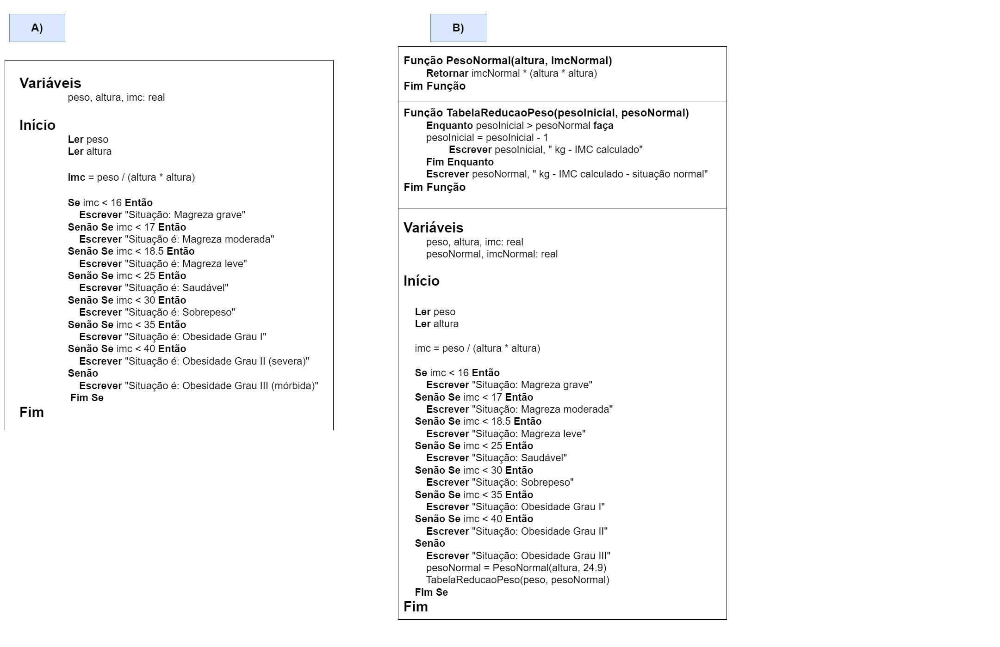

# Exercício 05 - fixação
  
## Introdução 
<div align="center">

_"O IMC é um índice importante para determinar as condições de saúde de
uma pessoa. Veja neste link informações sobre ele. <br> <br>
(a) Faça um algoritmo que permite calcular o IMC e que informe então a
situação de saúde do usuário. <br> <br>
(b) Modifique o algoritmo para que quando o usuário estiver em situação
extrema de grau 3, o algoritmo apresente uma tabela mostrando como o
IMC ficaria até entrar em situação normal, reduzindo kilo a kilo.  <br> <br>Exemplo: suponha que o usuário pesa 150 kg e entra em condição normal com
90 kg. <br> Então o algoritmo deve mostrar: <br> <br>
150 kg - IMC calculado <br>
149 kg - IMC calculado <br>
⋮ <br>
 90 kg - IMC calculado - situação normal"_

</div>

## Resolução

<div align="center">



</div>

### Observação

A linha abaixo:
```
pesoNormal = PesoNormal(altura, 24.9)
```

Foi colocado o valor 24.9 entendendo que o imc < 25 já validava a condição para a situação "saudável" 🍎🏃