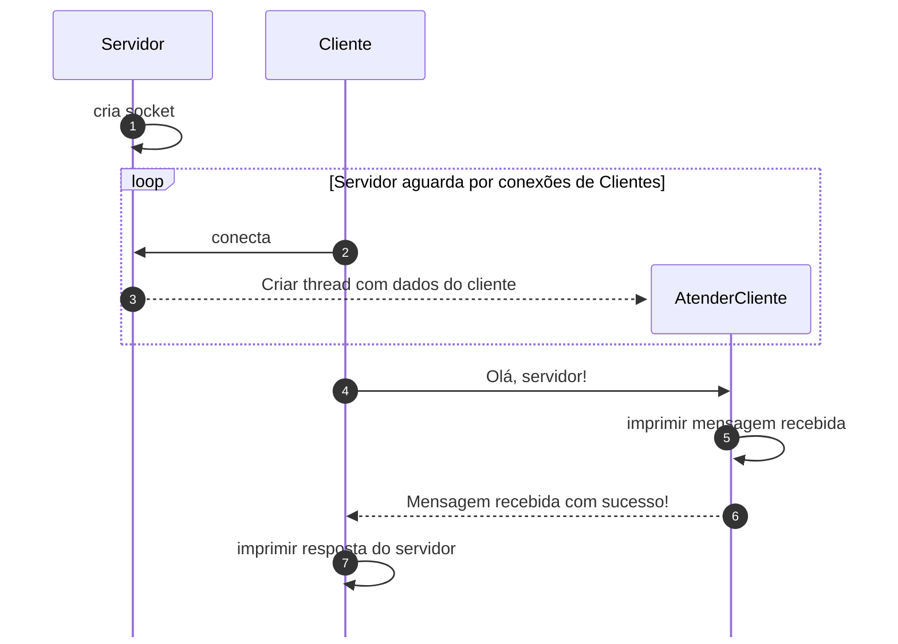

# Diagrama de sequência do protocolo

```mermaid
%%{init: {'sequence': { 'mirrorActors': false }}}%%
sequenceDiagram
    autonumber
    participant S as Servidor
    participant C as Cliente

    S->>S: cria socket

    loop Servidor aguarda por conexões de Clientes
        C->>S: conecta
        create participant T as AtenderCliente
        S-->>T: Criar thread com dados do cliente
    end
        C->>T: Olá, servidor!

        activate T
        T->>T: imprimir mensagem recebida
        T-->>C: Mensagem recebida com sucesso!

        C->>C: imprimir resposta do servidor

``` 